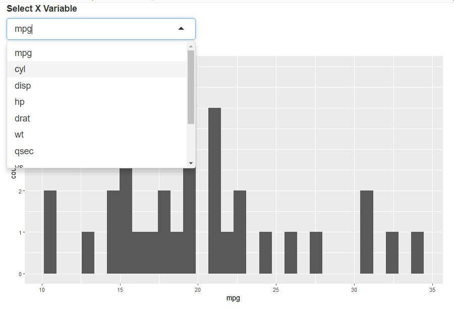
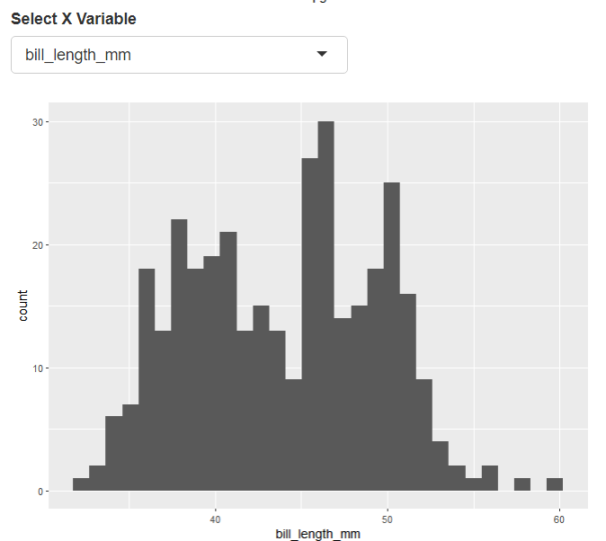

```{r xaringan-themer, include = FALSE}
library(xaringanthemer)
style_mono_accent(
  base_color = "midnightblue",
  header_font_google = google_font("Josefin Sans"),
  link_color = "steelblue",
  text_font_size = "24px",
  footnote_font_size = "20px",code_inline_font_size = "19px"
)
```

```{r xaringanExtra, echo=FALSE}
xaringanExtra::use_xaringan_extra(c("tile_view", "logo", "tachyons"))
xaringanExtra::use_panelset()
xaringanExtra::use_tachyons()
```

```{r setup, include=FALSE}
options(htmltools.dir.version = FALSE)
library(flair)
library(shiny)
library(ggplot2)
library(here)
source(here("module_demo_01/modules.R"))
data(mtcars)
mtcars <- data.frame(mtcars)
mtcars_var_choices = colnames(mtcars)
library(palmerpenguins)
data(penguins)
penguin_choices <- colnames(penguins)
```

# Why Modules?

- Motivating example
- Why?
- module code

---
# Motivating Example

- An ui that lets you pass in a dataset
- Lets you select columns from that dataset
- Want multiple plots in the same app

---



---
# Using Shiny modules

.pull-left.tiny[

## ui

```{r ui_min2, eval=FALSE, include=FALSE}
ui <- fluidPage(   
    select_hist_ui(id = "mtcars_module", 
                   var_choices = mtcars_var_choices)
    )
```

```{r echo=FALSE}
decorate("ui_min2") %>%
  flair("select_hist_ui", background="#cdecff") %>%
  flair("mtcars_module",background="#ffb700")
```

- note that .bg-lightest-blue[`select_hist_ui()`] is a function that takes an `id` argument
- uses an `id` called .bg-gold[`mtcars_module`]
  
]

.pull-right.tiny[

]

---
# Using Shiny modules

.pull-left.tiny[

## ui

```{r ui_min, eval=FALSE, include=FALSE}
ui <- fluidPage(   
    select_hist_ui(id = "mtcars_module", 
                   var_choices = mtcars_var_choices)
    )
```

```{r echo=FALSE}
decorate("ui_min") %>%
  flair("select_hist_ui", background="#cdecff") %>%
  flair("mtcars_module",background="#ffb700")
```

]

.pull-right.tiny[

## server
```{r server_min, eval=FALSE, include=FALSE}
server <- function(input, output) {
    select_hist_server(id="mtcars_module", 
                       data=mtcars)
}
```

```{r echo=FALSE}
decorate("server_min") %>%
  flair("mtcars_module", background="#ffb700") %>%
  flair("select_hist_server", background="#cdecff")
```

- Note that we have a function .bg-lightest-blue[`select_hist_server()`] 
- Also uses the `id` .bg-gold[`"mtcars_module"`] 
]


---
# Reusing code

.pull-left.tiny[

## ui

```{r ui_min3, eval=FALSE, include=FALSE}
ui <- fluidPage(   
    select_hist_ui(id = "mtcars_module", 
                   var_choices = mtcars_var_choices),
    select_hist_ui(id = "penguin_module",
                   var_choices = penguin_choices)
    )
```

```{r echo=FALSE}
decorate("ui_min3") %>%
  flair("select_hist_ui", background="#cdecff") %>%
  flair("penguin_module",background="#ffb700")
```

- note we have two .bg-lightest-blue[`select_hist_ui()`] functions
- the second one has the `id` of .bg-gold[`penguin_module`]

]

.pull-right.tiny[

]
---

# Reusing code

.pull-left.tiny[

## ui

```{r ui_min4, eval=FALSE, include=FALSE}
ui <- fluidPage(   
    select_hist_ui(id = "mtcars_module", 
                   var_choices = mtcars_var_choices),
    select_hist_ui(id = "penguin_module",
                   var_choices = penguin_choices)
    )
```

```{r echo=FALSE}
decorate("ui_min4") %>%
  flair("select_hist_ui", background="#cdecff") %>%
  flair("penguin_module",background="#ffb700")
```

]

.pull-right.tiny[

## server
```{r server_min4, eval=FALSE, include=FALSE}
server <- function(input, output) {
    select_hist_server(id="mtcars_module", 
                       data=mtcars)
  
    select_hist_server(id="penguin_module", 
                       data=penguins)
}
```

```{r echo=FALSE}
decorate("server_min4") %>%
  flair("penguin_module", background="#ffb700") %>%
  flair("select_hist_server",  background="#cdecff")
```

- Note that we have two functions .bg-lightest-blue[`select_hist_server()`] 
- The second one use the `id` .bg-gold[`"penguin_module"`] 
- We can have two different plots/interfaces!
]

---
# Two modules, two datasets

.pull-left[
- dataset is `mtcars`


]
.pull-right[
- dataset is `penguins`


]

---
# You may want to use Shiny Modules if:

- You want to reuse your code, especially in the same app
- You are tired of thinking up unique ids for all the elements in your app
- You need to break up a monolithic shiny application into pieces
- Separate presentation from code

---
# Maybe not:

- Your app is a one and done - single version
- It doesn't have that many controls

---
# ui module

```{r hist_mod, eval=FALSE, echo=FALSE}
select_hist_ui <- function(id, var_choices){
  #initialize a namespace ID function - our key to our namespace
  ns <- NS(id)
  
  #return a tagList with our ui elements
  tagList(
    #note we have to wrap the input id in our namespace function ns()
    selectInput(inputId = ns("x_var"), label="Select X Variable", 
                choices=var_choices, selected = var_choices[1]),
    plotOutput(ns("hist_plot"))
  )
}
```

```{r echo=FALSE}
decorate("hist_mod") %>%
  flair("ns <- NS(id)", background="#ffb700") %>%
  flair('ns("x_var")', background = "#ffb700") %>%
  flair('ns("hist_plot")', background = "#ffb700") %>%
  flair("select_hist_server",  background="#cdecff")
```

- Initialize the namespace for `id` using .bg-gold[`NS()`] function
- Need to refer to any controls/plots with ids wrapped in `ns()`, such as .bg-gold[`ns("x_var")`] or
.bg-gold[`ns("hist_plot")`]

---
# Server Module

```{r hist_serv, eval=FALSE, echo=FALSE}
select_hist_server <- function(id, data) {
  moduleServer(id, function(input, output, session) {

    output$hist_plot <- renderPlot({
      #notice we don't use ns() here to refer to input objects
      x_var <- input$x_var

      data %>% ggplot(aes_string(x=x_var)) +
        geom_histogram()
    
    })
    
})
  
}
```

```{r echo=FALSE}
decorate("hist_serv") %>%
  flair("moduleServer", background="#ffb700") %>%
  flair_lines(4:11)
```

- .bg-gold[`moduleServer()`] encapsulates your server code (in .bg-yellow[yellow])
- be really careful with closing curly brackets and parentheses

---
# Try them out

Install `shiny`, `palmerpenguins`, `tidyverse` first

Clone this repository:

https://github.com/laderast/shiny_module_tutorial/

Open up `shiny_module_tutorial.Rproj`

- Individual apps are in `module_demo_01` and `module_demo_02`

---
# For More Info/Thanks!

- [Mastering Shiny: Modules](https://mastering-shiny.org/scaling-modules.html)
- Slides were done using `xaringan`, `xaringanExtra`, and `flair`